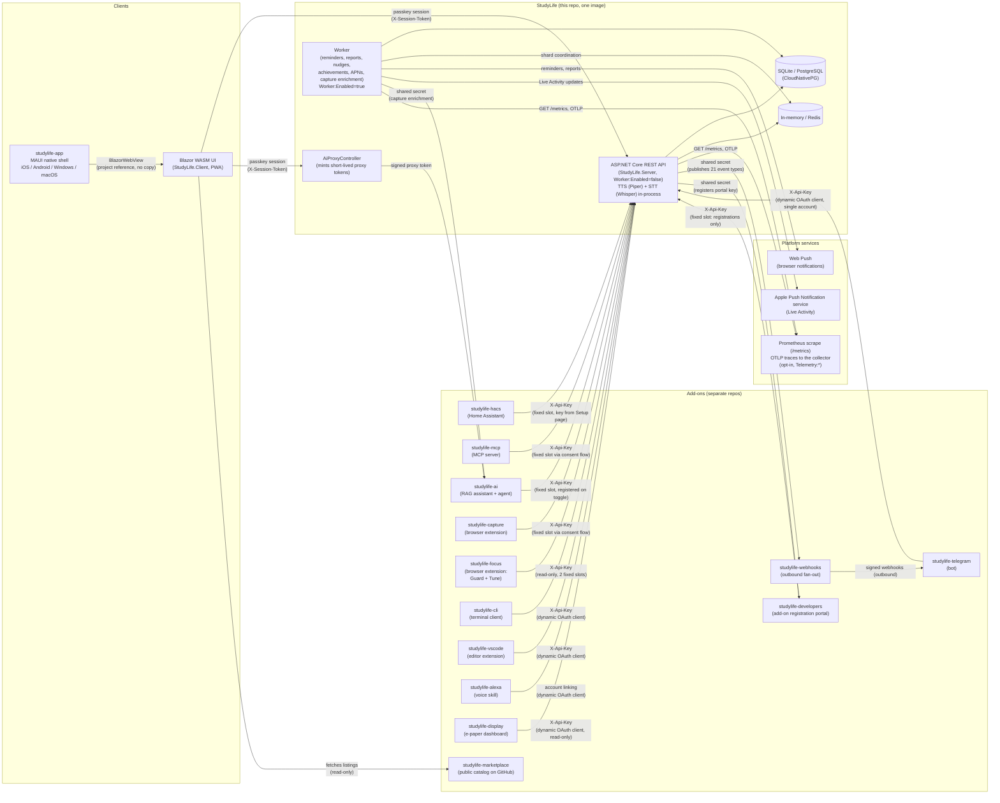

# StudyLife

[](https://github.com/lukislp/studylife/actions/workflows/ci-cd.yml) [](https://scorecard.dev/viewer/?uri=github.com/lukislp/studylife) [](https://github.com/lukislp/studylife/security/code-scanning)
[](https://github.com/lukislp/studylife/releases)
[](LICENSE)
[](https://dotnet.microsoft.com/)
[](https://github.com/lukislp/studylife/actions/workflows/ci-cd.yml)

> Personal study organization - calendar, focus timer, notes, and learning goals in one Blazor
> WebAssembly app. Multi-user with passkey login, designed to run on your own hardware, and the
> hub of a family of add-ons (native app, Home Assistant, AI assistant, MCP server, browser
> extensions, CLI, VS Code, Telegram, Alexa, an e-paper display, webhooks) that all talk to
> this one API.

**[Live demo](https://studylife-demo.lktec.org)** — read-only, running the actual
`ghcr.io/lukislp/studylife-server:latest` image published by this repo's own CI/CD pipeline
(`DEMO_MODE=true` plus the explicit `DEMO_MODE_CONFIRM_DATA_LOSS` confirmation, see
`Services/DemoModeGuard.cs`): signs you in automatically as a demo student mid-way through the
built-in study program, with weeks of study history, a live streak, and planned sessions ahead.
Edits apply locally but are never saved; the dataset reseeds itself relative to "today" on every
container restart.


---

## Architecture



`API` and `Worker` are the same container image, just started with a different `Worker:Enabled`
flag — a single-container deployment (`docker run`/`dotnet run`, `Worker:Enabled` defaulting to
`true`) runs both roles combined in one process; production and the horizontally-scalable setup
(Kubernetes/K3s via GitOps, see [docs/SCALING.md](docs/SCALING.md); `docker-compose.scale.yml` for
local testing of that same split) run them as separately scaled replicas instead, so that N web
replicas never fire the same push reminder N times — the worker replicas claim shards via Redis
and each user is handled by exactly one worker per 5-second tick (`Worker:ReplicaCountSource=Kubernetes`
reads the live replica count, so the worker can sit behind a HorizontalPodAutoscaler too).

The browser client and the native app authenticate exclusively via a passkey session (the MAUI
shell logs in through the system browser and receives its token via a PKCE-style handoff, never
in the redirect URL itself). Every add-on instead holds a long-lived, revocable, **per-user** API
key (`X-Api-Key`) that is scoped to exactly the endpoints that add-on's real client code calls
(`Auth/ApiKeyScopes.cs`, one auditable map). Those keys come in two shapes: a **fixed slot** per
first-party add-on (Home Assistant, studylife-ai, studylife-mcp, studylife-capture, the two
studylife-focus features, studylife-webhooks, studylife-developers) whose scope is hardcoded and
code-reviewed here, and a **dynamic OAuth client** registered through studylife-developers, which
gets an OAuth-style consent screen listing the scopes it asked for (studylife-cli, studylife-vscode,
studylife-telegram, studylife-alexa, studylife-display, and any third-party add-on from the
marketplace). `AiProxyController` mints a short-lived, HMAC-signed token per chat request instead
of forwarding a stored key (which only ever exists as a hash server-side, see
[Security](#security)) — studylife-ai verifies that signature locally against a shared secret, no
round-trip back here. `Worker` reaches studylife-ai the same way for capture enrichment
(`POST /internal/enrich-capture`), authenticated with a shared secret rather than a per-request
user token, since it runs outside any user's live session. [studylife-app](https://github.com/lukislp/studylife-app)
(the native iOS/Android/Windows/macOS shell) is a separate repo that pulls in this repo's entire
Blazor UI via a project reference — no copy, so the native app and the browser/PWA client are
always pixel-identical.

---

## Features

### Accounts & Login
- Passwordless login via passkey (WebAuthn) - no password to remember or leak
- Multiple users (e.g. family members): each has their own courses, sessions, notes, and settings, completely separated; self-registration is gated by the instance owner (`Registration__Mode`: `open`/`invite`/`closed`, default `invite`) with invite links created and managed on the Setup page
- Add another device of your own either directly on the device itself or via a linking code from an already logged-in device (no cross-device Bluetooth fumbling needed)
- New devices/additional passkeys must first be approved from an already logged-in device before they can be used
- Device management: rename passkeys, view the list, remove individually, and "sign out everywhere else" (removing a passkey or using a recovery code revokes every other session automatically)
- Emergency access via recovery codes: generate 8 one-time codes in Setup (shown only once) to sign in if the only registered device/passkey is ever lost
- Native app sign-in through the system browser with a PKCE-style token handoff (the bearer token never travels in the app's redirect URL)

### Language
- Fully usable in 26 languages: all 24 official EU languages (English, German, French, Spanish, Italian, Portuguese, Dutch, Danish, Swedish, Finnish, Greek, Polish, Czech, Slovak, Hungarian, Romanian, Bulgarian, Croatian, Slovenian, Estonian, Latvian, Lithuanian, Maltese, Irish) plus Ukrainian and Russian
- Switcher in the top right (positioned the same way on desktop and mobile): click the current flag, choose a language from the popup; the selection persists across restarts/browser sessions
- Localized weekday and month names everywhere, 12-hour clock for English and 24-hour clock for every other language

### Calendar
- Week view with a full 24-hour timeline, with an optional day view on mobile devices
- Create, edit, and delete study sessions
- Course, topic, start and end time per session
- Create recurring appointments (e.g. lectures) up to an end date in a single step - selectable interval (weekly/every 2/3/4 weeks) and multiple weekdays at once (e.g. Mon+Wed+Fri)
- Session templates (quick-add): save frequently recurring appointments (e.g. "Calculus lecture, 90 min, Mondays 10:00") as a template and apply it to the calendar with a click
- Import an `.ics` file (e.g. a university timetable export): the appointments are parsed server-side and shown for review, you pick the course per appointment, and only confirmed ones become sessions
- Current-time indicator
- Horizontally scrollable on mobile devices - times stay fixed
- Subscribable iCalendar feed for external calendar apps (Google/Apple Calendar, see Setup)
- Search (course/topic) and course filter (show/hide by clicking course pills)
- Warning for time-overlapping sessions (can still be saved)
- Delete confirmation for sessions (two clicks instead of immediate deletion)
- For recurring appointments: selectively delete "just this session", "this and all following", or "the entire series"
- Print the weekly schedule/export as PDF
- Automatic topic suggestion when creating a new session (from the course's still-open topics)
- Swipe gesture on mobile devices (swipe the header or calendar grid left/right) for quick week/day switching

### Study Planner
- Exam planner: choose a course and exam date - automatically distributes the still-open topics as study sessions across free time slots in the calendar up to the date (session length and total hours configurable, suggestion editable/removable before acceptance)
- Weekly plan assistant: suggests study sessions for the current week to fill the weekly quota - weighted toward courses that haven't been studied for the longest or whose exam is approaching soonest
- Both suggestions respect existing calendar appointments and the study windows set in Setup, and are only created as actual sessions after confirmation

### Focus Timer
- Six built-in modes (Pomodoro Classic, Flow State, Ultradian Rhythm, Claude Mode, Sprint Bursts, Micro Focus) plus your own custom modes (focus/break length and rounds, defined in Setup)
- Animated timer with progress ring
- Keeps running in the background when switching pages (singleton service)
- The timer state lives on the server: a session started in the browser, the native app, VS Code, or Telegram is the same session everywhere, and the worker keeps the iOS Live Activity in step with it while the app is closed
- Automatic switching between focus and break phases; optional automatic switch to the Focus page when a planned session starts
- Browser tab title shows the remaining time while the timer is running
- Sound and vibration feedback when a session completes
- Reflection prompt after a session ends ("What did you learn?"), saved directly as a linked note
- Movement-break reminder (native app only): after ~25 minutes of continuous, uninterrupted focus, a dismissible banner + notification suggests a short break if Apple HealthKit step data shows barely any movement
- Distraction blocking and automatic Spotify playlist switching while a session runs (via the [studylife-focus](https://github.com/lukislp/studylife-focus) browser extension's independently-toggleable Guard and Tune features): allowlist or blocklist specific sites with automatic tab redirect on session start and restore on session end, and/or switch to a focus/break Spotify playlist

### Dashboard
- Live updates: sessions, notes, settings, and every other change appear across your devices within a second, pushed by the server (Server-Sent Events) — no fixed polling interval to wait out; the summary itself is computed server-side (`GET /api/dashboard/summary`) and renders progressively
- Daily overview with active/next session
- Weekly statistics (sessions, hours, streak)
- Weekly quota (default 25-30 h, configurable) with progress bar and warning if falling short
- Monthly quota (default 100-130 h, configurable independently of the weekly goal)
- Course overview as pills
- Weekly trend of the last 8 weeks as a bar chart
- Upcoming course goals: the next 5 open goals with countdown or overdue notice
- Study progress tile: ECTS progress and weighted grade average at a glance
- Mini donut chart: course time distribution over the last 30 days
- Today tile: progress ring (hours today vs. daily goal) and 7-day streak bar
- Weekly comparison: delta in study hours versus the previous week
- Most recently completed sessions as a mini list
- Preview of the most recently edited note
- Balance check: which active course hasn't been studied for the longest
- Achievements: permanent milestone badges (total hours, longest streak, sessions, completed courses, all courses completed)
- Topic progress: checked-off course topics across all courses
- Inactivity notice directly in the dashboard (visible even without push notifications enabled)
- Series icon on today's sessions that are part of a recurring series
- ECTS forecast: expected completion date at the current study pace
- Target-completion tile: given a self-set target date, how many hours/week are needed for it
- Productivity hint: suggests the best time of day for the next session based on your study rhythm so far
- Month/year comparison: study hours versus the previous month and (if enough data is available) the same month in the previous year
- Course tags as small badges on the course pills (e.g. "exam soon")
- Global search / command palette (Ctrl+K / Cmd+K, or the speed-dial button on mobile) across courses, notes (full-text), and upcoming sessions
- Study readiness score (native app only): a personal Heart Rate Variability baseline comparison via Apple HealthKit - today's HRV against your own 30-day rolling average, with the raw values shown alongside the score
- Sleep consistency tile (native app only): how variable your bedtime has been over the last 30 nights, via Apple HealthKit sleep data

### Notes
- Free-text notes, optionally assigned to a course
- Togglable Markdown mode per note (headings, bold/italic, lists, quotes, code, tables, links) with a live preview — plain text stays the default, nothing changes for existing notes
- Read a note aloud: natively synthesized (German/English) via a self-hosted [Piper](https://github.com/rhasspy/piper) voice running inside the server (`StudyLife.Tts`, ONNX Runtime + espeak-ng), no cloud TTS service involved — every other language falls back to the browser's own built-in speech synthesis, so it works everywhere, just with native voice quality only for the two baked-in languages (see [docs/TTS-VOICES.md](docs/TTS-VOICES.md) for the full coverage matrix and voice licenses)
- Dictate a note instead of typing it: the recording is transcribed on your own server by a self-hosted [Whisper](https://github.com/ggerganov/whisper.cpp) model (`StudyLife.Stt`, the multilingual `base` model baked into the image) — audio never leaves your instance
- Automatic saving while typing; the open editor refreshes when another device changed the same note
- Full-text search (SQLite FTS5 / PostgreSQL tsvector, server-side) and course filter
- Delete confirmation (two clicks instead of immediate deletion)
- Link to the triggering focus session visible (🔗), if created from the reflection prompt
- Web capture (via the [studylife-capture](https://github.com/lukislp/studylife-capture) browser extension): save a selection or a whole article from any page as a note, auto-enriched in the background with a course match, tags, a one-sentence summary, and related-notes links
- AI study assistant (via [studylife-ai](https://github.com/lukislp/studylife-ai), opened from the speed dial): questions over your own notes/courses/sessions with source citations, and an agent that can create sessions or summarize-and-save notes after an explicit confirmation step

### Evaluation
- Hours studied and sessions per course
- ECTS-weighted grade average
- Study progress (achieved / total ECTS)
- Study heatmap: year view of daily study intensity (GitHub-style)
- Course time distribution as a donut chart
- Study rhythm: distribution by weekday and time of day
- Monthly course history (last 6 months) as a stacked bar chart
- Year in review: "Wrapped"-style summary (total hours, strongest course, most productive day/time, longest streak, total sessions)
- ECTS forecast and month comparison (previous month) in the study progress tile
- Study report as a printable PDF: total hours, hours per course, ECTS progress including grade average, course goal status - for scholarship applications or academic advising
- Cardio fitness (VO2max) trend (native app only): chart of Apple Watch-measured cardio fitness over the last year, via Apple HealthKit
- All of these numbers come from one shared metrics implementation (`StudyLife.Shared/StudyMetrics.cs`) that the dashboard, the evaluation page, the report, and the `GET /api/metrics/*` API used by Home Assistant and other add-ons all share

### Share Progress
- Optional, public read-only link (no login) with a compact progress snapshot (ECTS, grade average, topic progress of active courses) - for sharing with parents or a mentor
- Deliberately shows no notes, calendar details, or settings
- Can be disabled at any time or reissued with a new link

### Backup & Export
- JSON export of your own data (sessions, notes, course goals, settings) and re-import
- Full database download, optionally encrypted with a self-chosen password (AES-256)
- Restore from a previously downloaded backup, including the encrypted variant
- Weekly automatic background backup (the last 4 weeks are retained; SQLite deployments)
- Database download/restore is reserved for the account's original setup user; the JSON export is available to every account

### Notifications
- Session reminders at configurable lead times before a planned study phase (default 60/30/10/5/3/2/1 minutes)
- Permission is requested on the first app start
- Each reminder is sent only once (duplicate protection)
- Reminders before a course's target date (default 14/7/3/1/0 days ahead)
- Motivating reminder if no study session has taken place for several days (default 5 days), optionally per course
- Weekly review via push (Sunday evening) and a monthly report on the 1st
- Achievement push when a new milestone badge is unlocked
- Opt-in nudges: streak at risk, weekly goal falling behind, a course that is almost done, your historically best study time, a gentle comeback nudge after one idle day, and a daily motivational quote
- All reminder thresholds and every nudge individually configurable in Setup
- Native app: local notifications, home screen widgets, and an iOS Live Activity kept up to date by the server via APNs

### Setup
- Manually switch theme: System / Light / Dark, plus an accent color
- Activate/complete courses, set a target date per course
- Optionally record a grade (German grading system) and completion note when completing
- Topic checklist per course: check off individual topics, progress display (N/M)
- Set a course tag (free text, e.g. "exam soon") per course
- Course resources: a list of links (lecture notes, scripts, videos) per course
- Choose a preferred motivation profile
- Switch between the built-in study program (a real degree program shipped as example content) and your own custom ones (create, mark complete, delete); once you have a program of your own, the built-in one can be hidden from the switcher for good
- Calendar subscription URL for copying
- Weekly and monthly study goals, a desired graduation date, and custom timer modes
- Reminder thresholds (session lead time, course goal lead time, inactivity threshold) individually adjustable, plus on/off toggles for every optional nudge
- Study windows: hours (from/to) and weekdays adjustable, in which the exam planner and weekly plan assistant are allowed to suggest sessions
- Opt-in anonymous usage & error reports (performance and crash data only, never notes/sessions/health data) - off by default, asked once via a consent modal, changeable anytime
- Manage passkeys (rename, add more, remove, sign out everywhere else)
- Generate recovery codes for emergency access (shown once, invalidates previous codes)
- Invite links for new accounts (instance owner)
- Integrations: the Home Assistant key, the AI assistant and developer-portal toggles, named webhooks keys and webhook subscriptions, the Marketplace browser, and an "External connections" card that disconnects any add-on (fixed slot or dynamic client) with one click
- Manage backup/export/restore and the share-progress link

### PWA
- App icon shortcuts (long-press on the home screen icon): start focus, new note, calendar
- Offline write queue: sessions and settings saved while offline are replayed once the connection is back

### Native Apps
- [StudyLife App](https://github.com/lukislp/studylife-app) is a separate .NET MAUI Blazor Hybrid shell (iOS/Android/Mac/Windows) built on top of this repo's Blazor Client, adding native notifications, home screen widgets, Live Activities, Siri Shortcuts, an Apple Watch companion app, and Apple HealthKit integration (HRV-based study readiness, sleep consistency, a movement-break reminder, and a cardio fitness trend chart) - all read-only and processed entirely on-device, never leaving it.

---

## Technology

| Layer | Technology |
|---|---|
| Frontend | Blazor WebAssembly (.NET 10), PWA; i18n via Toolbelt.Blazor.I18nText |
| Backend | ASP.NET Core (.NET 10), controllers + service layer, OpenAPI contract committed under `docs/api/openapi.json` |
| Login | Passkey/WebAuthn (Fido2NetLib) |
| Database | SQLite via Entity Framework Core (default) - optionally PostgreSQL (Npgsql) for horizontally scalable operation, with twin migrations for both providers |
| Cache / coordination | In-memory (default) or Redis (`Cache:Provider=Redis`): response caching, session-token cache, rate-limit buckets, worker shard claims, Data Protection key ring |
| Speech | Piper voices via ONNX Runtime + espeak-ng (`StudyLife.Tts`), Whisper via Whisper.net (`StudyLife.Stt`) - both run inside the server, no external service |
| Push | Web Push (VAPID) and APNs (Live Activities) |
| Telemetry | OpenTelemetry: Prometheus exposition on a dedicated port, OTLP trace export, client beacon - all opt-in |
| Deployment | Kubernetes/K3s via GitOps (Flux), see below - `docker-compose.scale.yml` for local testing of that same setup |
| CI/CD | GitHub Actions with Semantic Release, Sigstore keyless signing, Trivy, CodeQL, OpenSSF Scorecard |

---

## Deployment

### Prerequisites
- A Kubernetes cluster ([K3s](https://k3s.io/) is what production actually runs on; any conformant cluster works) with `kubectl` configured against it, plus the operators the manifests assume: CloudNativePG, cert-manager, and NGINX Gateway Fabric (Gateway API). [docs/SCALING.md](docs/SCALING.md) walks through a from-scratch reference setup (MetalLB, gateway, TLS, monitoring) on a Raspberry Pi K3s cluster.

### Quick Start

```bash
git clone https://github.com/lukislp/studylife.git
cd studylife
kubectl apply -f k8s/
```

The manifests under `k8s/` deploy the full stack pulling the public `ghcr.io/lukislp/studylife-server` image - no registry login needed:

- `04-web.yaml` / `05-worker.yaml` - the two Deployments (same image, `Worker__Enabled` differs), each with a CPU-based HorizontalPodAutoscaler (`04c`/`05c`: web 2-4, worker 1-4 replicas), surge-only rollouts, read-only root filesystems, and a PodDisruptionBudget (`10-...`)
- `02-postgres.yaml` - a 3-instance PostgreSQL 16 cluster via CloudNativePG, `11-pooler.yaml` a PgBouncer pooler in front of it, `08-scheduled-backup.yaml` a daily 03:00 backup to S3-compatible object storage (30-day retention)
- `03-redis.yaml` - a 6-node Redis Cluster StatefulSet with client TLS and a dedicated ACL user
- `07d-httproutes.yaml` - Gateway API `HTTPRoute` for NGINX Gateway Fabric with backend TLS, asset caching, and an edge rate limit
- `12-network-policies.yaml` - default-deny ingress plus explicit allow rules (gateway to web, studylife-ai/-mcp/-developers to web, app to Postgres/pooler/Redis, Prometheus to the metrics ports)
- `01-config-and-secret.yaml` - the ConfigMap/Secret pair; `sealed-secrets/` holds the production values encrypted in Git
- `flux/` - the Flux `GitRepository` + `Kustomization` that reconciles `k8s/flux/deploy/` (web + worker) from `main`

`k8s/bootstrap-cluster.ps1` automates this end-to-end on a cluster that already has the operators above (your own Postgres password substituted in place of the repo's test placeholder, plus the one-time Redis cluster bootstrap and, optionally, the R2 backup and Flux) - see its header comment and [docs/SCALING.md](docs/SCALING.md) for the full walkthrough. `k8s/dev/` contains the plaintext placeholder secrets for the local kind learning cluster described there.

On the very first start (no user registered yet), the server outputs a one-time setup code to its logs (`kubectl -n studylife-scale logs -l app=studylife-web`) - this code is requested during the first passkey registration and protects against someone else on the same network claiming the initial registration before the actual operator. Every subsequent registration (e.g. family members) does not need this code, but by default needs an invite link from the owner.

A single-container deployment (`docker run ghcr.io/lukislp/studylife-server`, or plain `dotnet run` for local dev) works too and needs no Kubernetes at all - `Worker:Enabled` defaults to `true`, so one process/container handles both web traffic and the background tick, SQLite lives under `app_data/`, and the in-memory cache replaces Redis.

### Configuration

Server configuration is the ConfigMap/Secret pair in `k8s/01-config-and-secret.yaml` (prod manages the real values as encrypted-in-Git SealedSecrets instead, see [docs/SCALING.md](docs/SCALING.md), "Sealed Secrets") - the same `appsettings`/environment-variable keys apply to every deployment shape, k8s included. The typed sections live in `src/StudyLife.Server/Configuration/` and are validated at startup: `Database` (`Provider`, `ConnectionString`), `Cache` (`Provider`, Redis endpoints/TLS/password), `Worker` (`Enabled`, `ReplicaCount`, `ReplicaCountSource`), `Registration` (`Mode`), `Fido2` (relying-party pinning), `Consent` (PKCE enforcement, per-audience redirect allow-lists), `Vapid`, `Apns`, `Apple`, `StudyLifeAi`, `StudyLifeWebhooks`, `StudyLifeDevelopers`, `Speech`/`Tts`/`Stt`, `Telemetry` (`MetricsPort`, `OtlpEndpoint`, sample ratios), `WebBackendTls`, `ForwardedHeaders`. Every integration section is optional: with it unset, that integration is simply off. See [docs/SCALING.md](docs/SCALING.md#the-core-idea-configuration-instead-of-two-codebases) for the deployment-shape keys and [docs/ARCHITECTURE.md](docs/ARCHITECTURE.md) for the rest.

### Horizontally Scalable Operation

The k8s setup above already runs this way by default: PostgreSQL instead of SQLite, Redis instead of the in-memory cache, web and worker as separately scaled replicas (`Database:Provider=Postgres`, `Cache:Provider=Redis`). `docker-compose.scale.yml` reproduces the same topology locally, disposably, for testing/learning without a real cluster - see [docs/SCALING.md](docs/SCALING.md) for both. A complete, production-operated reference architecture (K3s cluster on Raspberry Pi, Postgres HA via CloudNativePG, Redis Cluster, NGINX Gateway Fabric, HorizontalPodAutoscalers, network policies, sealed secrets, Prometheus/Grafana/Loki/Tempo), including all lessons learned, is documented there too.

### Telemetry

Everything is opt-in and off by default. `Telemetry:MetricsPort` opens a dedicated, non-public Kestrel listener answering only `GET /metrics` in Prometheus format (ASP.NET Core, Kestrel, EF Core/Npgsql, .NET runtime, rate limiter, HttpClient meters plus StudyLife's own: cache outcomes, SSE streams, TTS, webhooks, worker tick). `Telemetry:OtlpEndpoint` exports request/HttpClient/Npgsql traces via OTLP to a collector (production forwards to Grafana Tempo), head-sampled at `Telemetry:TraceSampleRatio`. Client-side, `POST /api/telemetry` accepts a small batch of boot/vitals/API/SSE/error events - only after the user explicitly accepted the consent modal, never on the demo instance, and never carrying a user id, IP, or content. Details in [docs/ARCHITECTURE.md](docs/ARCHITECTURE.md#telemetry).

---

## Automatic Updates

Production uses GitOps, not a polling updater: Flux (`k8s/flux/`) reconciles `k8s/flux/deploy/` (the web and worker Deployments) from this repository's `main` branch every 5 minutes. The image tag in `k8s/04-web.yaml`/`k8s/05-worker.yaml` is not bumped by Flux's image automation anymore but by the pipeline itself: after a release, the `deploy-bump` job writes the released version into those manifests and pushes it over a deploy key, so Flux (read-only) rolls the new image out - the exact deployed manifest is always what's checked into Git, and the image is only ever one that passed the Trivy gate and was signed with cosign. This replaced an older single-container setup where Watchtower polled for new images and restarted the container itself, and the intermediate Flux image-update automation; see [docs/SCALING.md](docs/SCALING.md), "GitLab Integration: Kubernetes Agent + Flux Image Automation" for the history.

---

## Development

### Prerequisites
- .NET 10 SDK
- Visual Studio 2022+ or Rider
- Python 3 for the i18n/date-format checks (`tools/check-i18n.py`, `tools/check-date-formats.py`)

### Starting

```bash
cd src/StudyLife.Server
dotnet run
```

The app is then reachable at `https://localhost:53963`. The SQLite database is automatically created under `app_data/studylife.db`. The speech features need the Piper voices (`tts-voices/`) and the Whisper model (`stt-model/`) next to the server, which the Dockerfile downloads at image build time; without them the TTS/dictation endpoints answer 404 and everything else works. Run `dotnet format StudyLife.sln` before pushing (CI verifies it), and commit the regenerated `docs/api/openapi.json` after any controller/DTO change.

### Project Structure

```
src/
|-- StudyLife.Client/           # Blazor WebAssembly frontend (PWA)
|   |-- Pages/                  # Dashboard, Calendar, Focus, Notes, Planner, WeekPlan, Stats, Wrapped, Report,
|   |                           # Setup, Login/Register/Link, SharedProgress, Connect* consent pages
|   |-- Components/             # Dashboard/Calendar/Focus/Setup/Stats cards, consent + telemetry modals
|   |-- Services/               # AppStateService (offline write queue), TimerService, TelemetryService,
|   |                           # MarketplaceClient, SessionHandler, native-platform interfaces
|   |-- i18ntext/               # 26 languages x every text table
|   `-- wwwroot/                # Static assets, CSS, index.html, service worker
|-- StudyLife.Server/           # ASP.NET Core backend + background worker (one image)
|   |-- Auth/                   # Authentication handler, policies, ApiKeyScopes (the per-slot scope map)
|   |-- Configuration/          # Typed options sections, validated at startup
|   |-- Controllers/            # One controller per API area (AuthController split into numbered partials)
|   |-- Services/               # Domain services, BackgroundTaskService subtasks, proxies to the add-on services
|   |-- Data/ + Migrations/     # EF Core DbContexts, twin migrations for SQLite and PostgreSQL
|   `-- Dockerfile              # Multi-arch runtime image; pulls the Piper voices + Whisper model
|-- StudyLife.Shared/           # DTOs, course catalog, shared metrics + summary builders, planner, JSON context
|-- StudyLife.Tts/              # Piper text-to-speech: voice registry, espeak-ng phonemizer, Markdown-to-speech
`-- StudyLife.Stt/              # Whisper speech-to-text (Whisper.net)
tests/
|-- StudyLife.Server.Tests/     # Integration tests against the real pipeline (auth, scopes, demo mode, worker, ...)
|-- StudyLife.Shared.Tests/     # Metrics, planner, golden fixtures, DTO contracts
|-- StudyLife.Client.Tests/     # bUnit tests for client services and dialogs
`-- StudyLife.Tts.Tests/        # Text chunking and Markdown-to-speech
k8s/                            # Namespace, config/secret, CNPG Postgres, Redis Cluster, web + worker (+ HPAs),
|                               # HTTPRoutes, scheduled backup, PDBs, pooler, network policies
|-- flux/                       # Flux GitRepository + Kustomization (reconciles flux/deploy/)
|-- sealed-secrets/             # Production secrets, encrypted in Git
|-- dev/                        # Placeholder secrets for the local kind learning cluster
`-- bootstrap-cluster.ps1       # App-stack bootstrap on a prepared cluster
docs/
|-- ARCHITECTURE.md             # Architecture, API, security model, telemetry, notes for changes
|-- SCALING.md                  # Postgres/Redis/K8s reference setup and every lesson learned
|-- TTS-VOICES.md               # Voice coverage matrix and licenses
`-- api/                        # openapi.json (committed contract), metrics fixtures
.github/workflows/
|-- ci-cd.yml                   # Test, build, release, image, Trivy, cosign, deploy-bump
|-- scorecard.yml               # OpenSSF Scorecard
|-- dependency-review.yml       # Advisory check on PR dependency changes
`-- dependabot-*.yml            # Lock-file regeneration and auto-merge for Dependabot PRs
docker-compose.scale.yml        # Local Postgres + Redis + N web replicas + worker + load balancer
Directory.Build.props           # Locked restores, warnings as errors
```

Architecture, API reference, and notes for changes: [docs/ARCHITECTURE.md](docs/ARCHITECTURE.md).

---

## Add-ons

Every add-on lives in its own repository and extends this app without its own database or user
system: each one that talks to the API does so with a per-user, narrowly scoped API key
(`X-Api-Key`) whose allowed endpoints are fixed in `Auth/ApiKeyScopes.cs`. Two
provisioning shapes exist. **Fixed slot**: a first-party integration whose scope is hardcoded and
code-reviewed here - the key is either generated manually on the Setup page (Home Assistant,
webhooks), registered automatically when you flip a toggle (AI assistant, developer portal), or
obtained through a browser sign-in/consent flow on your own instance (MCP, Capture, Focus).
**Dynamic OAuth client**: an add-on registered through studylife-developers with its own client
ID, redirect URIs, and requested scopes; connecting it shows the generic consent screen with
exactly those scopes, and the resulting key can only reach what it asked for.

| Add-on | What it does | Auth model | Read-only? |
|---|---|---|---|
| [studylife-app](https://github.com/lukislp/studylife-app) | .NET MAUI Blazor Hybrid shell (iOS/Android/Mac/Windows) that reuses this repo's Blazor UI; native notifications, widgets, Live Activities, Siri, Apple Watch, HealthKit tiles | Passkey session via the system browser, PKCE-style token handoff | No (it is the app) |
| [studylife-hacs](https://github.com/lukislp/studylife-hacs) | Home Assistant custom integration: 30+ sensors, calendars, a course picker, six services | Fixed slot `ha`, key generated once on the Setup page | No (creates/edits sessions and goals, switches programs) |
| [studylife-ai](https://github.com/lukislp/studylife-ai) | RAG study assistant with citations, LangGraph agent with a confirmation flow, capture enrichment; FastAPI + LiteLLM + Qdrant | Chat: short-lived HMAC proxy token minted per request. Indexing worker: fixed slot `ai`, registered automatically on the Setup toggle. Enrichment: shared secret | No (creates sessions and notes after confirmation) |
| [studylife-mcp](https://github.com/lukislp/studylife-mcp) | MCP server for Claude and other MCP clients; stdio or Streamable HTTP with its own OAuth 2.1 server | Fixed slot `mcp` via the `/connect/mcp` consent flow | No (create note, create session; no update/delete) |
| [studylife-capture](https://github.com/lukislp/studylife-capture) | Chrome extension (MV3) saving selections or whole articles as notes, enriched by studylife-ai | Fixed slot `capture` via the `/connect/capture` consent flow | No (creates notes only) |
| [studylife-focus](https://github.com/lukislp/studylife-focus) | Chrome extension (MV3): Guard blocks/allows sites during a session, Tune switches a Spotify playlist | Two fixed slots `focusguard`/`focustunes`, each via its own consent flow | Yes (`GET /api/timerstate` only) |
| [studylife-cli](https://github.com/lukislp/studylife-cli) | Terminal client for notes, sessions, goals, timer, courses, programs, webhooks; `--json` on every command | Dynamic OAuth client (`studylife login` opens the browser) | No (whichever write scopes you grant) |
| [studylife-vscode](https://github.com/lukislp/studylife-vscode) | VS Code sidebar: control the focus timer, log coding time as study sessions | Dynamic OAuth client | No (`TimerState.Save`, `Sessions.Create`) |
| [studylife-telegram](https://github.com/lukislp/studylife-telegram) | Telegram bot: start/pause/stop the timer, today/agenda, quick notes, session-event and reminder messages | Dynamic OAuth client, one key for the single account it serves (chat allowlist on the bot side); receives events as a studylife-webhooks subscriber | No (timer, sessions, notes) |
| [studylife-alexa](https://github.com/lukislp/studylife-alexa) | Alexa Skill backend: study time, next session, goals, program progress, note search, create a note by voice | Account linking: its own OAuth 2.0 server wraps the dynamic-client consent flow | Mostly (only `Notes.Create` writes) |
| [studylife-display](https://github.com/lukislp/studylife-display) | Raspberry Pi e-paper dashboard: today's hours, streak, next exam countdown, weekly goal, heatmap, timer line | Dynamic OAuth client with three read scopes | Yes |
| [studylife-webhooks](https://github.com/lukislp/studylife-webhooks) | Outbound fan-out: signed HTTP callbacks for session/note/goal/... events to Zapier, n8n, Discord, bots | StudyLife calls it with a shared secret; subscriptions are managed from the Setup page or with a named fixed-slot `webhooks` key | n/a (never calls back into study data) |
| [studylife-developers](https://github.com/lukislp/studylife-developers) | Portal for registering your own add-on (client ID, scopes, redirect URIs) against your instance | Fixed slot `developer`, registered automatically on the Setup toggle; can only manage your registrations | n/a (no study data) |
| [studylife-marketplace](https://github.com/lukislp/studylife-marketplace) | Public catalog of add-on manifests, validated in CI | None - your browser fetches the listings read-only from GitHub | n/a |

Keys of both shapes are shown in plaintext exactly once (or never, for the toggle and consent
flows), stored only as a hash, and revocable from the Setup page at any time; a leaked key
compromises exactly one account and only the endpoints its slot or grant allows. The
[Security](#security) section has the details.

## Add-on Marketplace

Beyond the first-party integrations above, StudyLife has a generic, data-driven client registry so **any** third-party add-on can plug in without a code change to StudyLife itself: a developer registers their own add-on's name, description, redirect URIs, and the exact API scopes it needs, and it gets the same OAuth-style consent screen the first-party consent flows use, generalized to any registered client (`AuthController.10.OAuthClients.cs`, `Pages/ConnectClient.razor`).

- **Browse & install**: the Setup page's Marketplace card lists every add-on published to [studylife-marketplace](https://github.com/lukislp/studylife-marketplace), fetched directly from GitHub by your own browser (cached for 24 hours). Installing registers the add-on on your instance and takes you straight to a consent screen showing exactly what it's asking for.
- **[studylife-marketplace](https://github.com/lukislp/studylife-marketplace)** - the public catalog: one JSON manifest per add-on (name, developer, requested scopes, redirect URI, a link to the add-on's own repository - never code), added via pull request and validated in CI against a JSON schema. Its `known-scopes.json` mirrors `ApiKeyScopes.PubliclyGrantable`.
- **[studylife-developers](https://github.com/lukislp/studylife-developers)** - the portal for registering your own add-on against your own instance: a client ID, the scopes it needs (drawn from `ApiKeyScopes.PubliclyGrantable`, an explicit allowlist that excludes anything owner-only like settings, invites, or backups), and its redirect URIs. Pairs with your instance the same toggle-and-forget way as the AI assistant.
- Granted scopes are snapshotted onto the issued key at the moment the user consents (`ClientApiKeyEntity.GrantedScopes`), never re-read live from the add-on's registration - a developer widening their add-on's requested scopes later never silently escalates access for users who already installed it; the consent page also echoes the scope list it rendered, and the server rejects the connect if the registration changed in between.
- The one publicly grantable write scope that no fixed slot has is `TimerState.Save` ("Start, pause and stop the live timer"): it lets an add-on drive the timer where the user actually is - editor, chat, voice - and is safe to grant because the worst case is a session the user ends with one click.

## Command-Line Interface

[studylife-cli](https://github.com/lukislp/studylife-cli) is a terminal client for notes, sessions, course goals, the focus timer, courses, study programs, and webhooks - with a `--json` flag on every command for scripting, study-time reports and exports, and a live dashboard. It registers itself through the same generic dynamic-client mechanism as the Add-on Marketplace above (`studylife login` opens your browser to approve the connection, the key lands in a local config file) rather than through any dedicated server-side code, so it needs nothing StudyLife itself doesn't already expose.

## Webhooks

[studylife-webhooks](https://github.com/lukislp/studylife-webhooks) delivers signed HTTP callbacks (`X-StudyLife-Webhook-Signature`, HMAC-SHA256 over the raw body) to your own automations (Zapier, n8n, Discord, and similar) or to add-ons such as studylife-telegram. Unlike the add-ons above it's an outbound event pipe rather than something that reads study data: StudyLife's backend publishes 21 event types (`Services/WebhookEventTypes.cs` - timer started/ended, session created/completed/deleted, new record, note created/updated/deleted, course goal created/updated/completed/deleted, course resource and session template created/deleted, study program created/completed/deleted, plan generated) to the service with a shared secret, and the service fans them out to every matching subscription. Subscriptions are created, listed, and deleted from the Setup page; alternatively, one or more independently-named `webhooks` API keys let an external program manage its own subscriptions through `api/webhooks` - and nothing else. Private, loopback, and cluster-internal target URLs are rejected before they are ever registered.

## Home Assistant Integration

[StudyLife for Home Assistant](https://github.com/lukislp/studylife-hacs) is a separate HACS custom integration that maps dashboard and evaluation data (active/next session, weekly/monthly statistics, streak including the longest ever achieved series, quotas, grade average, ECTS progress, ECTS forecast, month comparison, achievements, topic progress, course tags, course catalog, live timer phase, weekly review as an event) as sensors, binary sensors (including inactivity warning), and calendars (sessions plus course goals) in Home Assistant - one device per study program - plus a dropdown of active courses (`select.studylife_active_course`) and six services for creating/editing/deleting sessions and course goals, generating an exam plan, and switching the active program. All numbers come pre-computed from `GET /api/metrics/summary` and `GET /api/metrics/achievements`, the same shared metrics code the dashboard uses. The pairing runs via a per-user API key generated once on the Setup page (see [Security](#security)). Installation and details are in that repo's README.

## Contributing

Pull requests are welcome - [CONTRIBUTING.md](CONTRIBUTING.md) describes the process (issue first for bigger changes, Conventional Commits, tests for new functionality, the required checks) and how to run everything locally.

## Security

Login runs exclusively via passkey (WebAuthn) - there is no password and no unauthenticated API access. The very first registration on a fresh installation additionally requires the setup code output once to the server logs (see Deployment above); every subsequent registration (e.g. for family members) creates its own account, completely separate from other users - by default it requires an invite link created by the instance owner on the Setup page (`Registration__Mode`: `open`/`invite`/`closed`, default `invite`). A session token extends on a sliding basis with active use (90 days), but forces a fresh login after 180 days at the latest. An additional device can either be registered directly or paired via a time-limited linking code from an already logged-in device - in both cases an already logged-in device must first approve the new device via device management before it can be used. Removing a passkey, a recovery-code login, and the explicit "sign out everywhere else" button all revoke every other session; the recovery-code login is additionally throttled per IP and by an instance-wide bucket that forged client IPs cannot bypass.

For non-interactive integrations like Home Assistant, which cannot maintain a passkey session, a long-lived, **per-user** API key can be generated on the Setup page (`X-Api-Key` header) - it does not rotate automatically, but can be revoked immediately at any time; a leaked key therefore only ever compromises exactly one account. Every key slot is scoped to only the endpoints its integration actually calls (`Auth/ApiKeyScopes.cs`: `ha` is the widest because it manages the calendar and settings on the user's behalf, `focusguard`/`focustunes` the narrowest with `GET /api/timerstate` alone) and a request outside that scope answers 403; the enforcement is unconditional, there is no configuration switch that turns it off. The other first-party add-ons (AI, MCP, Capture, Focus, developers portal) receive their equally scoped keys without any manual copying - via a Setup toggle or a browser sign-in/consent flow whose redirect targets are allow-listed per audience - and can be disconnected from the Setup page at any time. Dynamically registered add-ons can only request scopes from `ApiKeyScopes.PubliclyGrantable` (never settings, invites, backups, or restore), the consent flow supports PKCE (mandatory with `Consent:RequirePkce`), the granted scopes are frozen onto the key at consent time, re-consenting supersedes the previous key, and every issued key is listed and revocable per user. The subscribable iCalendar feed and the optional public share-progress link each use their own separate tokens that can reach nothing but their single endpoint.

Around that: per-IP rate limiting on `/api` (shared across replicas via Redis in the scaled deployment, plus an edge limit on the gateway), a per-user concurrency cap on the CPU-heavy endpoints (transcription, synthesis, AI proxy, export, exam planner), bounded request bodies and inputs everywhere, an outbound-URL policy that refuses private/loopback/cluster-internal targets for push subscriptions and webhooks, a strict Content-Security-Policy, HSTS, `X-Frame-Options: DENY`, and a `Permissions-Policy` that allows only the microphone (for dictation). The demo instance blocks every mutating request in middleware and only arms itself when `DEMO_MODE_CONFIRM_DATA_LOSS` is set explicitly, so a stray `DEMO_MODE=true` can never wipe a real database. Details on the complete security model (including the audits that shaped it): [docs/ARCHITECTURE.md](docs/ARCHITECTURE.md#security).

Vulnerabilities: please report them privately via [GitHub's private vulnerability reporting](https://github.com/lukislp/studylife/security/advisories/new), see [SECURITY.md](SECURITY.md). Supply chain: NuGet restores run in locked mode against committed `packages.lock.json` files, GitHub Actions are SHA-pinned and kept current by Dependabot, every pull request runs a dependency review, CodeQL scans the code, the OpenSSF Scorecard runs weekly, the published image is scanned by Trivy and signed keyless with Sigstore cosign (with SBOM and SLSA provenance attached), and the release ZIP carries a cosign bundle plus GitHub build provenance.

---

## CI/CD Pipeline

Runs as GitHub Actions (`.github/workflows/ci-cd.yml`) on every push to `main`, every pull request targeting it, and every merge-queue build.

| Stage | Job | Description |
|---|---|---|
| test | `test-unit` | `dotnet test` for all four test projects (Shared, Server, Tts, Client), plus a self-hosted coverage badge (`.github/badges/coverage.json`) generated from the merged coverage report |
| test | `test-i18n` | `check-i18n.py` (all 26 languages, every table) and `check-date-formats.py` |
| test | `test-lint` | `dotnet format --verify-no-changes` |
| test | `test-security` | NuGet vulnerability scan; High/Critical findings fail the build |
| test | `test-openapi-contract` | Fails if the committed `docs/api/openapi.json` differs from the built API |
| test | `test-ef-migrations` | Fails if the SQLite or the PostgreSQL model has changes without a migration |
| test | `test-k8s-manifests` | `kubeconform` schema validation of `k8s/` and of the kustomize output Flux actually applies |
| test | `test-compose-scale` | Syntax/interpolation check of `docker-compose.scale.yml` |
| build | `build` | Restore (`--locked-mode` against the committed `packages.lock.json` files, like every restore in CI) and build all projects (needs all test jobs to pass) |
| version | `get-version` | Semantic Release dry run against Conventional Commits; the rest of the chain skips itself when no release is due. Push events only |
| publish | `publish-server` | `dotnet publish` (linux-x64 + linux-arm64) + ZIP artifact |
| release | `semantic-release` | Real semantic-release run: publishes the GitHub release + changelog, commits the coverage badge, then signs `server.zip` (keyless Sigstore bundle + GitHub build provenance uploaded next to it) |
| docker | `docker-server` | Per-architecture (amd64/arm64) image builds pushed by digest to the public `ghcr.io/lukislp/studylife-server` registry, with SBOM and SLSA provenance attestations |
| docker | `trivy-server` | Container vulnerability scan of the freshly built image; reports HIGH+CRITICAL informationally, blocks the manifest merge (and thereby the deploy) on any fixable CRITICAL finding |
| docker | `docker-manifest-merge` | Creates the multi-arch manifest, signs it keyless with cosign, and verifies the signature |
| deploy | `deploy-bump` | Writes the released version into the `k8s/` manifests and pushes it over the deploy key, so Flux (read-only) rolls the new image out |

`get-version` through `deploy-bump` form a serialized release chain (`concurrency: studylife-release-chain`) and only run on pushes to `main`, never on pull requests. Pull requests merge through GitHub's merge queue: every queued PR is rebuilt on top of the current `main` (the `merge_group` trigger runs the test stage again) before it lands, so a merge can never be tested against a stale base. Alongside: `dependency-review.yml` (advisory check on every PR's dependency changes), `scorecard.yml` (weekly OpenSSF Scorecard), `dependabot-lockfiles.yml`/`dependabot-auto-merge.yml` (lock-file regeneration and auto-merge of patch/minor Dependabot updates), and CodeQL via GitHub's default setup. The shared actions and reusable workflows come from [lukislp/ci-workflows](https://github.com/lukislp/ci-workflows), pinned by SHA.

Versioning via Conventional Commits:
- feat: minor version
- fix: patch version
- BREAKING CHANGE: major version

---

## License

Copyright (C) 2026 Lukas Koerber

[AGPL-3.0](LICENSE) - if you run a modified version of this app as a network service, you
must make your modified source available to its users. The Home Assistant integration is
maintained as a separate, MIT-licensed repository: see [Home Assistant Integration](#home-assistant-integration).

The English text-to-speech voice (`en_US-amy-low`, used by the "read note aloud" feature) is
built on the [Mimic 3 voices](https://github.com/MycroftAI/mimic3-voices) dataset, licensed
[CC-BY-SA-4.0](https://creativecommons.org/licenses/by-sa/4.0/) - attribution required. The
German voice (`de_DE-thorsten-low`, [Thorsten-Voice](https://github.com/thorstenMueller/Thorsten-Voice))
is CC0. Both via [rhasspy/piper-voices](https://huggingface.co/rhasspy/piper-voices); see
[docs/TTS-VOICES.md](docs/TTS-VOICES.md) for the full coverage matrix and licenses.
