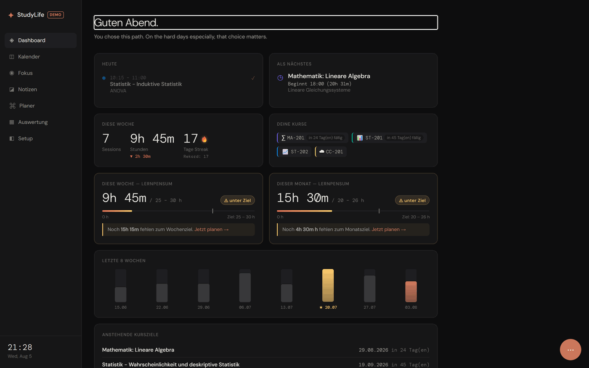
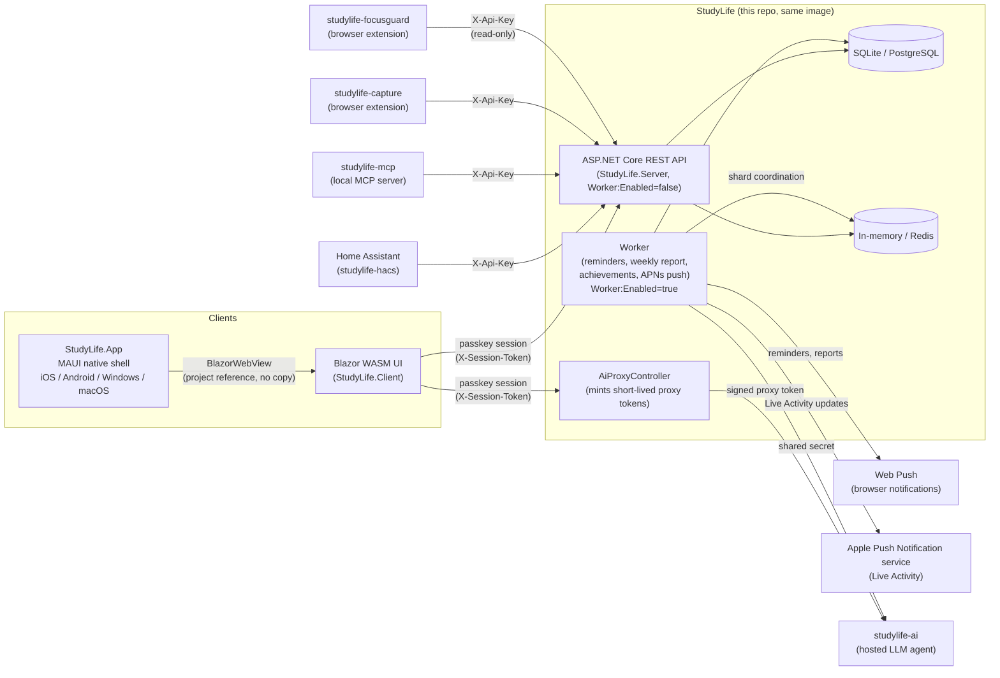

# StudyLife

[](https://github.com/lukislp/studylife/actions/workflows/ci-cd.yml)
[](https://github.com/lukislp/studylife/releases)
[](LICENSE)
[](https://dotnet.microsoft.com/)
[](https://github.com/lukislp/studylife/actions/workflows/ci-cd.yml)

> Personal study organization - calendar, focus timer, and learning goals in one modern Blazor WebAssembly app. Multi-user capable with passkey login, designed to run on your own home network.

**[Live demo](https://studylife-demo.lktec.org)** — read-only, running the actual
`ghcr.io/lukislp/studylife-server:latest` image published by this repo's own CI/CD pipeline
(`DEMO_MODE=true`): signs you in automatically as a demo student mid-way through the built-in
study program, with weeks of study history, a live streak, and planned sessions ahead. Edits
apply locally but are never saved; the dataset reseeds itself relative to "today" on every
container restart.



---

## Architecture



`API` and `Worker` are the same container image, just started with a different `Worker:Enabled`
flag — a single-container deployment (`docker run`/`dotnet run`, `Worker:Enabled` defaulting to
`true`) runs both roles combined in one process; production and the horizontally-scalable setup
(Kubernetes/K3s via GitOps, see [docs/SCALING.md](docs/SCALING.md); `docker-compose.scale.yml` for
local testing of that same split) run them as separately scaled replicas instead, so that N web
replicas never fire the same push reminder N times — exactly one `Worker` shard set (coordinated
via Redis once it scales past a single replica) owns the 30s reminder/report tick.

The browser client authenticates exclusively via its passkey session; Home Assistant,
studylife-mcp, studylife-capture, and studylife-focusguard instead each get their own
long-lived, revocable per-user API key (`X-Api-Key`) — neither can hold a live browser session,
so a bare API key is
deliberately accepted from them but never from the AI proxy path. `AiProxyController` mints a
short-lived, HMAC-signed token per request instead of forwarding a stored key (which only ever
exists as a hash server-side, see [Security](#security)) — studylife-ai verifies that signature
locally against a shared secret, no round-trip back here. `Worker` reaches studylife-ai the same
way for capture enrichment (`POST /internal/enrich-capture`, course matching plus tags/summary
for notes saved via studylife-capture), authenticated with that same shared secret rather than a
per-request user token, since it runs outside any user's live session. `StudyLife.App` (the
native iOS/Android/Windows/macOS shell) is a
separate repo that pulls in this repo's entire Blazor UI via a project reference — no copy, so
the native app and the browser/PWA client are always pixel-identical.

---

## Features

### Accounts & Login
- Passwordless login via passkey (WebAuthn) - no password to remember or leak
- Multiple users possible (e.g. family members): each has their own courses, sessions, notes, and settings, completely separated
- Add another device of your own either directly on the device itself or via a linking code from an already logged-in device (no cross-device Bluetooth fumbling needed)
- New devices/additional passkeys must first be approved from an already logged-in device before they can be used
- Device management: rename passkeys, view the list, remove individually
- Emergency access via recovery codes: generate 8 one-time codes in Setup (shown only once) to sign in if the only registered device/passkey is ever lost

### Language
- Fully usable in 26 languages: all 24 official EU languages (English, German, French, Spanish, Italian, Portuguese, Dutch, Danish, Swedish, Finnish, Greek, Polish, Czech, Slovak, Hungarian, Romanian, Bulgarian, Croatian, Slovenian, Estonian, Latvian, Lithuanian, Maltese, Irish) plus Ukrainian and Russian
- Switcher in the top right (positioned the same way on desktop and mobile): click the current flag, choose a language from the popup; the selection persists across restarts/browser sessions

### Calendar
- Week view with an hourly timeline (07:00 - 22:00), with an optional day view on mobile devices
- Create, edit, and delete study sessions
- Course, topic, start and end time per session
- Create recurring appointments (e.g. lectures) up to an end date in a single step - selectable interval (weekly/every 2/3/4 weeks) and multiple weekdays at once (e.g. Mon+Wed+Fri)
- Session templates (quick-add): save frequently recurring appointments (e.g. "Calculus lecture, 90 min, Mondays 10:00") as a template and apply it to the calendar with a click
- Current-time indicator
- Horizontally scrollable on mobile devices - times stay fixed
- Subscribable iCalendar feed for external calendar apps (Google/Apple Calendar, see Setup)
- Search (course/topic) and course filter (show/hide by clicking course pills)
- Warning for time-overlapping sessions (can still be saved)
- Delete confirmation for sessions (two clicks instead of immediate deletion)
- For recurring appointments: selectively delete "just this session", "this and all following", or "the entire series"
- Print the weekly schedule/export as PDF
- Automatic topic suggestion when creating a new session (from the course's still-open topics)
- Swipe gesture on mobile devices (swipe the header or calendar grid left/right) for quick week/day switching

### Study Planner
- Exam planner: choose a course and exam date - automatically distributes the still-open topics as study sessions across free time slots in the calendar up to the date (session length and total hours configurable, suggestion editable/removable before acceptance)
- Weekly plan assistant: suggests study sessions for the current week to fill the weekly quota (25-30 h) - weighted toward courses that haven't been studied for the longest or whose exam is approaching soonest
- Both suggestions respect existing calendar appointments and are only created as actual sessions after confirmation

### Focus Timer
- Predefined modes: Pomodoro, Flow, Ultradian, Claude, Sprint
- Animated timer with progress ring
- Keeps running in the background when switching pages (singleton service)
- Automatic switching between focus and break phases
- Browser tab title shows the remaining time while the timer is running
- Sound and vibration feedback when a session completes
- Reflection prompt after a session ends ("What did you learn?"), saved directly as a linked note
- Movement-break reminder (native app only): after ~25 minutes of continuous, uninterrupted focus, a dismissible banner + notification suggests a short break if Apple HealthKit step data shows barely any movement
- Distraction blocking while a session runs (via the [studylife-focusguard](https://github.com/lukislp/studylife-focusguard) browser extension): allowlist or blocklist specific sites, with automatic tab redirect on session start and restore on session end

### Dashboard
- Daily overview with active/next session
- Weekly statistics (sessions, hours, streak)
- Weekly quota (goal: 25-30 h) with progress bar and warning if falling short
- Monthly quota - grows dynamically with the weeks of the month
- Course overview as pills
- Weekly trend of the last 8 weeks as a bar chart
- Upcoming course goals: the next 5 open goals with countdown or overdue notice
- Study progress tile: ECTS progress and weighted grade average at a glance
- Mini donut chart: course time distribution over the last 30 days
- Today tile: progress ring (hours today vs. daily goal) and 7-day streak bar
- Weekly comparison: delta in study hours versus the previous week
- Most recently completed sessions as a mini list
- Preview of the most recently edited note
- Balance check: which active course hasn't been studied for the longest
- Achievements: permanent milestone badges (total hours, longest streak, sessions, completed courses, all courses completed)
- Topic progress: checked-off course topics across all courses
- Inactivity notice directly in the dashboard (visible even without push notifications enabled)
- Series icon on today's sessions that are part of a recurring series
- ECTS forecast: expected completion date at the current study pace
- Target-completion tile: given a self-set target date, how many hours/week are needed for it
- Productivity hint: suggests the best time of day for the next session based on your study rhythm so far
- Month/year comparison: study hours versus the previous month and (if enough data is available) the same month in the previous year
- Course tags as small badges on the course pills (e.g. "exam soon")
- Study readiness score (native app only): a personal Heart Rate Variability baseline comparison via Apple HealthKit - today's HRV against your own 30-day rolling average, with the raw values shown alongside the score
- Sleep consistency tile (native app only): how variable your bedtime has been over the last 30 nights, via Apple HealthKit sleep data

### Notes
- Free-text notes, optionally assigned to a course
- Togglable Markdown mode per note (headings, bold/italic, lists, quotes, code, tables, links) with a live preview — plain text stays the default, nothing changes for existing notes
- Read a note aloud: natively synthesized (German/English) via a self-hosted [Piper](https://github.com/rhasspy/piper) voice, no cloud TTS service involved — every other language falls back to the browser's own built-in speech synthesis, so it works everywhere, just with native voice quality only for the two baked-in languages (see [docs/TTS-VOICES.md](docs/TTS-VOICES.md) for the full coverage matrix and voice licenses)
- Automatic saving while typing
- Search (title/content) and course filter
- Delete confirmation (two clicks instead of immediate deletion)
- Link to the triggering focus session visible (🔗), if created from the reflection prompt
- Web capture (via the [studylife-capture](https://github.com/lukislp/studylife-capture) browser extension): save a selection or a whole article from any page as a note, auto-enriched in the background with a course match, tags, a one-sentence summary, and related-notes links

### Evaluation
- Hours studied and sessions per course
- ECTS-weighted grade average
- Study progress (achieved / total ECTS)
- Study heatmap: year view of daily study intensity (GitHub-style)
- Course time distribution as a donut chart
- Study rhythm: distribution by weekday and time of day
- Monthly course history (last 6 months) as a stacked bar chart
- Year in review: "Wrapped"-style summary (total hours, strongest course, most productive day/time, longest streak, total sessions)
- ECTS forecast and month comparison (previous month) in the study progress tile
- Study report as a printable PDF: total hours, hours per course, ECTS progress including grade average, course goal status - for scholarship applications or academic advising
- Cardio fitness (VO2max) trend (native app only): chart of Apple Watch-measured cardio fitness over the last year, via Apple HealthKit

### Share Progress
- Optional, public read-only link (no login) with a compact progress snapshot (ECTS, grade average, topic progress of active courses) - for sharing with parents or a mentor
- Deliberately shows no notes, calendar details, or settings
- Can be disabled at any time or reissued with a new link

### Backup & Export
- JSON export of your own data (sessions, notes, course goals, settings)
- Full database download, optionally encrypted with a self-chosen password (AES-256)
- Restore from a previously downloaded backup, including the encrypted variant
- Weekly automatic background backup (the last 4 weeks are retained)
- Database download/restore is reserved for the account's original setup user; the JSON export is available to every account

### Browser Notifications
- Automatic reminder 10 minutes before a planned study phase
- Permission is requested on the first app start
- Each session is notified only once (duplicate protection)
- Reminders before a course's target date (default 14/7/3/1/0 days ahead)
- Motivating reminder if no study session has taken place for several days (default 5 days)
- Weekly review via push (Sunday evening)
- All reminder thresholds individually configurable in Setup

### Setup
- Manually switch theme: System / Light / Dark
- Activate/complete courses, set a target date per course
- Optionally record a grade (German grading system) and completion note when completing
- Topic checklist per course: check off individual topics, progress display (N/M)
- Set a course tag (free text, e.g. "exam soon") per course
- Choose a preferred motivation profile
- Calendar subscription URL for copying
- Reminder thresholds (session lead time, course goal lead time, inactivity threshold) individually adjustable
- Study windows: hours (from/to) and weekdays adjustable, in which the exam planner and weekly plan assistant are allowed to suggest sessions
- Manage passkeys (rename, add more, remove)
- Generate recovery codes for emergency access (shown once, invalidates previous codes)
- Generate/revoke API key for the Home Assistant integration
- Manage backup/export and the share-progress link

### PWA
- App icon shortcuts (long-press on the home screen icon): start focus, new note, calendar

### Native Apps
- [StudyLife App](https://github.com/lukislp/studylife-app) is a separate .NET MAUI Blazor Hybrid shell (iOS/Android/Mac/Windows) built on top of this repo's Blazor Client, adding native notifications, home screen widgets, Live Activities, Siri Shortcuts, an Apple Watch companion app, and Apple HealthKit integration (HRV-based study readiness, sleep consistency, a movement-break reminder, and a cardio fitness trend chart) - all read-only and processed entirely on-device, never leaving it.

---

## Technology

| Layer | Technology |
|---|---|
| Frontend | Blazor WebAssembly (.NET 10) |
| Backend | ASP.NET Core (.NET 10) |
| Login | Passkey/WebAuthn (Fido2NetLib) |
| Database | SQLite via Entity Framework Core (default) - optionally PostgreSQL for horizontally scalable operation, see below |
| Deployment | Kubernetes/K3s via GitOps (Flux), see below - `docker-compose.scale.yml` for local testing of that same setup |
| CI/CD | GitHub Actions with Semantic Release |

---

## Deployment

### Prerequisites
- A Kubernetes cluster ([K3s](https://k3s.io/) is what production actually runs on; any conformant cluster works) with `kubectl` configured against it

### Quick Start

```bash
git clone https://github.com/lukislp/studylife.git
cd studylife
kubectl apply -f k8s/
```

The manifests under `k8s/` deploy the full stack (web + worker, Postgres via CloudNativePG, Redis, ingress) pulling the public `ghcr.io/lukislp/studylife-server` image - no registry login needed. `k8s/bootstrap-cluster.ps1` automates this end-to-end (your own Postgres password substituted in place of the repo's test placeholder, plus the one-time Redis cluster bootstrap and, optionally, Flux GitOps for automatic image updates - see [Automatic Updates](#automatic-updates) below) - see its header comment and [docs/SCALING.md](docs/SCALING.md) for the full walkthrough, including a from-scratch reference setup (MetalLB, ingress, TLS, monitoring) on a Raspberry Pi K3s cluster.

On the very first start (no user registered yet), the server outputs a one-time setup code to its logs (`kubectl -n studylife-scale logs -l app=studylife-web`) - this code is requested during the first passkey registration and protects against someone else on the same network claiming the initial registration before the actual operator. Every subsequent registration (e.g. family members) does not need this code.

A single-container deployment (`docker run ghcr.io/lukislp/studylife-server`, or plain `dotnet run` for local dev) works too and needs no Kubernetes at all - `Worker:Enabled` defaults to `true`, so one process/container handles both web traffic and the background reminder/report tick, same as it always has.

### Configuration

Server configuration is the ConfigMap/Secret pair in `k8s/01-config-and-secret.yaml` (prod manages the real values as an encrypted-in-Git SealedSecret instead, see [docs/SCALING.md](docs/SCALING.md), "Sealed Secrets") - the same `appsettings`/environment-variable keys documented in [docs/SCALING.md](docs/SCALING.md#the-core-idea-configuration-instead-of-two-codebases) (`Database:Provider`, `Cache:Provider`, `Worker:Enabled`, ...) apply to every deployment shape, k8s included.

### Horizontally Scalable Operation

The k8s setup above already runs this way by default: PostgreSQL instead of SQLite, Redis instead of the in-memory cache, web and worker as separately scaled replicas (`Database:Provider=Postgres`, `Cache:Provider=Redis`). `docker-compose.scale.yml` reproduces the same topology locally, disposably, for testing/learning without a real cluster - see [docs/SCALING.md](docs/SCALING.md) for both. A complete, production-operated reference architecture (2-node K3s cluster on Raspberry Pi, Postgres HA via CloudNativePG, Redis Cluster, NGINX Gateway Fabric, HorizontalPodAutoscaler, monitoring stack), including all lessons learned, is documented there too.

---

## Automatic Updates

Production uses GitOps, not a polling updater: Flux (`k8s/flux/`) watches the public `ghcr.io/lukislp/studylife-server` package for new SemVer tags, commits the new tag directly into `k8s/04-web.yaml`/`k8s/05-worker.yaml`, and applies it to the cluster - no manual step, and the exact deployed manifest is always what's checked into Git. This replaced an older single-container setup where Watchtower polled for new images and restarted the container itself; see [docs/SCALING.md](docs/SCALING.md), "GitLab Integration: Kubernetes Agent + Flux Image Automation" for the full setup and that migration.

---

## Development

### Prerequisites
- .NET 10 SDK
- Visual Studio 2022+ or Rider

### Starting

```bash
cd src/StudyLife.Server
dotnet run
```

The app is then reachable at `https://localhost:5001`. The SQLite database is automatically created under `app_data/studylife.db`.

### Project Structure

```
src/
|-- StudyLife.Client/       # Blazor WebAssembly frontend
|   |-- Pages/              # Razor pages (Dashboard, Calendar, Focus, Setup, Login/Register)
|   |-- Services/           # AppStateService, TimerService, NotificationService
|   |-- Models/             # Client-side models
|   `-- wwwroot/            # Static assets, CSS, index.html
|-- StudyLife.Server/       # ASP.NET Core backend
|   |-- Controllers/        # API endpoints
|   `-- Data/               # EF Core DbContext, SQLite/Postgres
`-- StudyLife.Shared/       # DTOs, course catalog, shared metrics logic
```

Architecture, API reference, and notes for changes: [docs/ARCHITECTURE.md](docs/ARCHITECTURE.md).

---

## Add-ons

Four separate repos extend this app without their own database or user system - each authenticates with a per-user, narrowly scoped API key (`X-Api-Key`) against StudyLife's existing API. The keys are provisioned per add-on: enabling the AI assistant in Setup registers its key automatically, the MCP server and the two browser extensions obtain theirs through a browser sign-in/consent flow on your own instance, and only Home Assistant uses a key generated manually on the Setup page.

- **[studylife-ai](https://github.com/lukislp/studylife-ai)** - a RAG study assistant with source citations over your own notes/courses/sessions, a LangGraph agent with a confirmation flow for write actions, and a RAGAS eval pipeline in CI. FastAPI + LiteLLM (provider-agnostic - API models or fully local via Ollama) + Qdrant.
- **[studylife-mcp](https://github.com/lukislp/studylife-mcp)** - a Model Context Protocol server exposing StudyLife to Claude and other MCP clients: read tools (courses, notes, sessions, course goals), write tools (create note, create session), and a self-built OAuth 2.1 authorization server for multi-user remote access.
- **[studylife-capture](https://github.com/lukislp/studylife-capture)** - a Chrome extension (Manifest V3) for saving a selection or a whole article from any page as a StudyLife note, using a dedicated `CaptureApiKey` provisioned via a one-click browser consent flow. Saved notes are enriched asynchronously by a StudyLife background task calling studylife-ai: course match (scoped to your active courses), tags, a one-sentence summary, related-notes links, and immediate search indexing.
- **[studylife-focusguard](https://github.com/lukislp/studylife-focusguard)** - a Chrome extension (Manifest V3) that blocks or allows sites while a focus-timer session is running (allowlist or blocklist, your choice), plus automatic tab redirect/restore around a session's start and end. Its `FocusGuardApiKey` is deliberately the narrowest of any add-on's - it can only poll `GET /api/timerstate`, never read or write notes, sessions, or settings.

## Home Assistant Integration

[StudyLife for Home Assistant](https://github.com/lukislp/studylife-hacs) is a separate HACS custom integration that maps dashboard and evaluation data (active/next session, weekly/monthly statistics, streak including the longest ever achieved series, quotas, grade average, ECTS progress, ECTS forecast, month comparison, achievements, topic progress, course tags, course catalog, live timer phase, weekly review as an event) as sensors, binary sensors (including inactivity warning), and calendars (sessions plus course goals) in Home Assistant, plus a dropdown of active courses (`select.studylife_active_course`) and services for creating/editing/deleting sessions and course goals. The pairing runs via a per-user API key generated once on the Setup page (see [Security](#security)). Installation and details are in that repo's README.

## Security

Login runs exclusively via passkey (WebAuthn) - there is no password and no unauthenticated API access anymore. The very first registration on a fresh installation additionally requires the setup code output once to the server logs (see Deployment above); every subsequent registration (e.g. for family members) creates its own account, completely separate from other users - by default it requires an invite link created by the instance owner on the Setup page (`Registration__Mode`: `open`/`invite`/`closed`, default `invite`). A session token extends on a sliding basis with active use (90 days), but forces a fresh login after 180 days at the latest. An additional device can either be registered directly or paired via a time-limited linking code from an already logged-in device - in both cases an already logged-in device must first approve the new device via device management before it can be used.

For non-interactive integrations like Home Assistant, which cannot maintain a passkey session, a long-lived, **per-user** API key can be generated on the Setup page (`X-Api-Key` header) - it does not rotate automatically, but can be revoked immediately at any time; a leaked key therefore only ever compromises exactly one account, and each key slot is additionally scoped to only the endpoints its integration needs. The other add-ons (AI, MCP, Capture, FocusGuard) receive their equally scoped keys without any manual copying - via the Setup toggle or a browser sign-in/consent flow - and can be disconnected from the Setup page at any time. The subscribable iCalendar feed and an optional public share-progress link each use their own separate tokens instead of the API key. Details on the complete security model (including the results of a targeted security review): [docs/ARCHITECTURE.md](docs/ARCHITECTURE.md#security).

---

## CI/CD Pipeline

Runs as GitHub Actions (`.github/workflows/ci-cd.yml`) on every push to `main` and every pull request targeting it.

| Stage | Job | Description |
|---|---|---|
| test | `test-unit` | Full `dotnet test` run (Shared + Server), plus a self-hosted coverage badge (`.github/badges/coverage.json`) generated from the merged coverage report |
| test | `test-i18n` | `check-i18n.py` - all 26 languages, every table |
| test | `test-lint` | `dotnet format --verify-no-changes` |
| test | `test-security` | NuGet vulnerability scan (non-blocking, fails visibly on High/Critical) |
| test | `test-k8s-manifests` | `kubeconform` schema validation of `k8s/` |
| test | `test-compose-scale` | Syntax/interpolation check of `docker-compose.scale.yml` |
| build | `build` | Restore and build all projects (needs all test jobs to pass) |
| version | `get-version` | Semantic Release dry run against Conventional Commits; fails the run if no releasable version is determined. Push events only |
| publish | `publish-server` | `dotnet publish` (linux-x64 + linux-arm64) + ZIP artifact. Push to `main` only, and only if `get-version` found a releasable version |
| docker | `docker-server` | Multi-arch (amd64/arm64) Docker image, built and pushed to the public `ghcr.io/lukislp/studylife-server` registry |
| docker | `trivy-server` | Container vulnerability scan (Trivy) of the freshly published image, informational only (does not block the pipeline) |
| release | `semantic-release` | Real semantic-release run: publishes the GitHub release + changelog, commits the coverage badge |

`get-version` through `semantic-release` form a serialized release chain (`concurrency: studylife-release-chain`) and only run on pushes to `main`, never on pull requests.

Versioning via Conventional Commits:
- feat: minor version
- fix: patch version
- BREAKING CHANGE: major version

---

## License

Copyright (C) 2026 Lukas Koerber

[AGPL-3.0](LICENSE) - if you run a modified version of this app as a network service, you
must make your modified source available to its users. The Home Assistant integration is
maintained as a separate, MIT-licensed repository: see [Home Assistant Integration](#home-assistant-integration).

The English text-to-speech voice (`en_US-amy-low`, used by the "read note aloud" feature) is
built on the [Mimic 3 voices](https://github.com/MycroftAI/mimic3-voices) dataset, licensed
[CC-BY-SA-4.0](https://creativecommons.org/licenses/by-sa/4.0/) - attribution required. The
German voice (`de_DE-thorsten-low`, [Thorsten-Voice](https://github.com/thorstenMueller/Thorsten-Voice))
is CC0. Both via [rhasspy/piper-voices](https://huggingface.co/rhasspy/piper-voices); see
[docs/TTS-VOICES.md](docs/TTS-VOICES.md) for the full coverage matrix and licenses.
